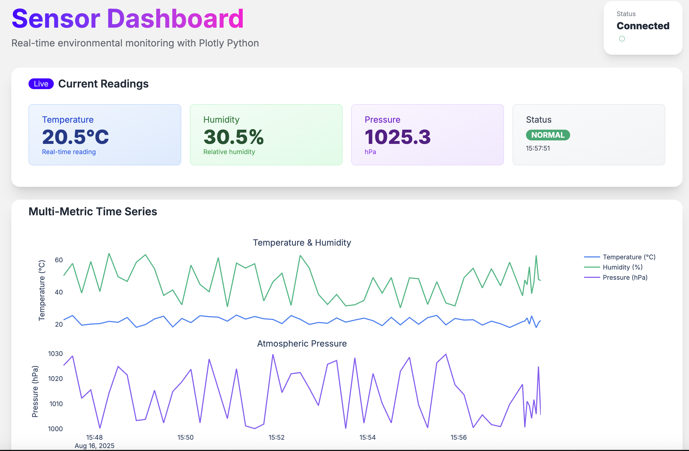

# Real-Time Sensor Dashboard



Real-time environmental monitoring dashboard with FastAPI, HTMX, Plotly Python charts, and Polars data processing - featuring 1-second updates, anomaly detection, and production logging.

## Features

- **Real-time updates** - Charts refresh every second via Server-Sent Events
- **Interactive visualizations** - Plotly charts with zoom, pan, hover
- **Statistical analysis** - Z-score anomaly detection and correlation matrices
- **Lightning-fast processing** - Polars DataFrames (10-30x faster than Pandas)
- **Production logging** - Loguru with automatic rotation and structured output
- **Responsive design** - Mobile-friendly with DaisyUI + Tailwind CSS

## Quick Start

```bash
# Clone and setup
git clone https://github.com/Boadzie/sensor-dashboard-plotly
cd sensor-dashboard-plotly
uv sync

# Run development server
DEBUG=1 uv run uvicorn app:app --reload --port 8000
```

Visit http://localhost:8000

## Architecture

```
┌─────────────┐    SSE     ┌──────────────┐    Polars    ┌─────────────┐
│   Browser   │ ◄─────────► │   FastAPI    │ ◄───────────► │  Data Layer │
│   (HTMX)    │             │              │              │             │
└─────────────┘             └──────────────┘              └─────────────┘
                                    │
                                    ▼
                            ┌──────────────┐
                            │    Plotly    │
                            │   Charts     │
                            └──────────────┘
```

## Project Structure

```
sensor-dashboard-plotly/
├── app.py              # FastAPI app with SSE streaming
├── utils.py            # Sensor simulation + Polars processing
├── chart_utils.py      # Plotly chart factory
├── templates/          # HTMX templates
│   ├── base.html
│   ├── index.html
│   ├── charts.html
│   └── sensor_data.html
└── pyproject.toml
```

## Key Components

### Data Processing (utils.py)

- Simulated environmental sensors (temperature, humidity, pressure)
- Polars DataFrames for 10-30x faster operations
- Z-score anomaly detection
- Circular buffer with `deque(maxlen=100)`

### Chart Generation (chart_utils.py)

- Server-side Plotly chart rendering
- Time series with dual y-axes
- Status distribution pie charts
- Correlation heatmaps
- Anomaly highlighting

### Real-time Streaming (app.py)

- FastAPI with Server-Sent Events
- 1-second chart updates via HTMX
- Performance monitoring and health checks
- Loguru structured logging

## API Endpoints

- `/` - Main dashboard
- `/stream` - SSE sensor data stream
- `/charts` - Chart HTML generation
- `/sensor-data` - Current readings
- `/health` - System health metrics
- `/metrics` - Detailed performance data

## Production Deployment

### Docker

```dockerfile
FROM python:3.11-slim
RUN pip install uv
COPY pyproject.toml ./
RUN uv sync --frozen
COPY . .
CMD ["uv", "run", "uvicorn", "app:app", "--host", "0.0.0.0"]
```

### Environment Variables

```bash
DEBUG=false
ENVIRONMENT=production
```

## Performance

- **Polars benefits**: 5-30x faster DataFrame operations, 50-80% memory reduction
- **Server-side rendering**: Consistent styling, reduced browser load
- **Efficient updates**: Only HTML transfers, preserves chart interactivity
- **Scalable**: Handles 100+ concurrent connections

## Development

```bash
# Install dependencies
uv sync

# Run with hot reload and debug logging
DEBUG=1 uv run uvicorn app:app --reload --port 8000

# View logs
tail -f logs/app_*.log
```

## Tech Stack

- **Backend**: FastAPI, Server-Sent Events
- **Frontend**: HTMX, DaisyUI, Tailwind CSS
- **Charts**: Plotly Python
- **Data**: Polars DataFrames
- **Logging**: Loguru
- **Package Manager**: uv

## Article

Read the full tutorial: [Building Real-Time Dashboards with FastAPI, HTMX & Plotly Python](https://medium.com/@boadziedaniel/building-real-time-dashboards-with-fastapi-htmx-plotly-python)

## License

MIT
